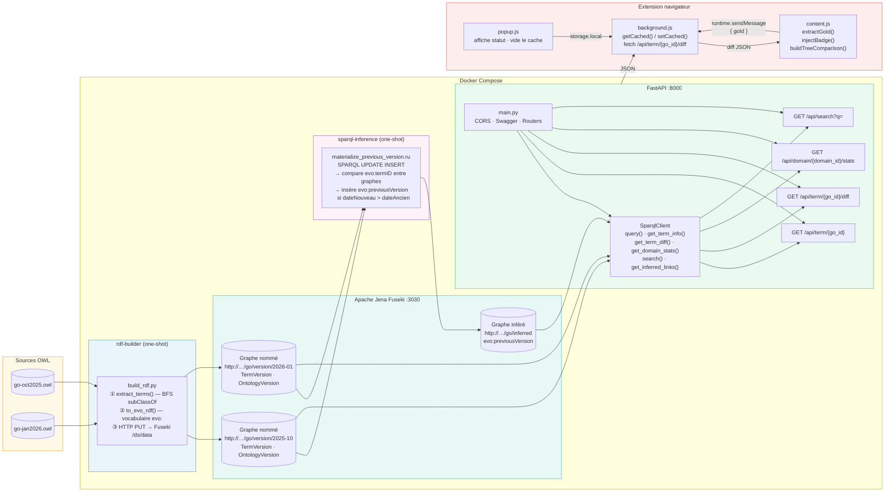
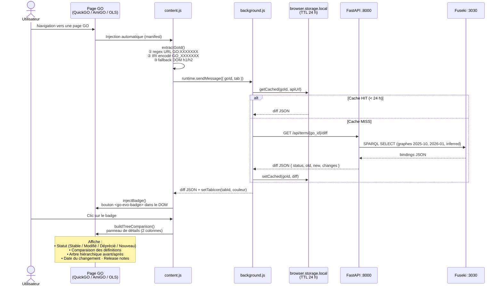

# Documentation technique — GO Evolution

> INF6253 · Projet 2 — Web sémantique  
> Comparaison de deux versions de Gene Ontology (oct. 2025 → jan. 2026) sur le domaine *DNA repair* (`GO:0006281`)

---

## Table des matières

1. [Vue d'ensemble](#1-vue-densemble)
2. [Partie 1 — Analyse comparative (notebook)](#2-partie-1--analyse-comparative-notebook)
3. [Partie 2 — Pipeline de données et API](#3-partie-2--pipeline-de-données-et-api)
4. [Partie 3 — Extension navigateur](#4-partie-3--extension-navigateur)
5. [Démarrage rapide](#5-démarrage-rapide)
6. [Endpoints API](#6-endpoints-api)
7. [Avancement et état du projet](#7-avancement-et-état-du-projet)

---

## 1. Vue d'ensemble

Le projet se décompose en trois parties indépendantes mais articulées :


| Partie   | Rôle                                                         | Technologie                         |
| -------- | ------------------------------------------------------------ | ----------------------------------- |
| Analyse  | Comparaison quantitative et qualitative des deux versions GO | Python, owlready2, rdflib, pandas   |
| Backend  | Triplestore + inférence + API REST                           | Apache Jena Fuseki, FastAPI, Docker |
| Frontend | Extension navigateur GO Evolution                            | JavaScript MV2/MV3 (Firefox/Chrome) |


Les deux fichiers OWL sources (`go-oct2025.owl` et `go-jan2026.owl`) sont partagés entre la partie analyse (lecture directe) et la partie backend (chargement dans Fuseki).

---

## 2. Partie 1 — Analyse comparative (notebook)

Le notebook `analyse/analyse.ipynb` orchestre cinq modules Python (`load_ontologies.py`, `quantitative_analysis.py`, `qualitative_analysis.py`, `reasoner_analysis.py`) et produit des tableaux pandas ainsi que des graphes de réseau interactifs.

### Flux d'exécution du notebook

```mermaid
flowchart TD
    A([Fichiers OWL\ngo-oct2025 · go-jan2026]) --> B

    subgraph S1["Section 1 — Exploration générale"]
        B["load_ontology()\nrdflib.Graph.parse()"]
        B --> C["get_stats()\nnb_classes · nb_props · nb_axiomes"]
        C --> D[("DataFrame comparatif\nGO_10-25 vs GO_01-26\nΔ = +55 classes, +4 props, −2278 axiomes")]
    end

    D --> E

    subgraph S2["Section 2 — Analyse quantitative (domaine DNA repair)"]
        E["get_domain_terms(GO:0006281)\nBFS sur rdfs:subClassOf"]
        E --> F["Comptage des termes du domaine\n44 → 46 classes"]
        F --> G["Termes nouveaux : 3\nTermes dépréciés : 0"]
        G --> H[("DataFrame domaine\n+ graphe réseau interactif\nvis-network.js")]
    end

    H --> I

    subgraph S3["Section 3 — Analyse qualitative (5 termes)"]
        I["get_term_comparison()\nIAO:0000115 · rdfs:label"]
        I --> J["Comparaison des définitions\n→ 0 changement détecté"]
        J --> K["get_direct_parents()\nComparaison de la hiérarchie"]
        K --> L["Extraction des Restriction OWL\npart_of · regulates → 0 changement"]
        L --> M[("DataFrame qualitatif\n5 termes analysés")]
    end

    M --> N

    subgraph S4["Section 4 — Raisonnement ontologique"]
        N["owlready2.get_ontology().load()"]
        N --> O["HermiT (via Java 25)\nsync_reasoner_hermit()"]
        O --> P["Mesure du temps de raisonnement\n51.33 s (GO_10-25)\n46.10 s (GO_01-26)"]
        P --> Q["Vérification de cohérence\nconsistent = True · 0 incohérence"]
        Q --> R[("reasoner_results.json\nrapport de raisonnement")]
    end

    style S1 fill:#e8f4f8,stroke:#2980b9
    style S2 fill:#e8f8e8,stroke:#27ae60
    style S3 fill:#fff8e8,stroke:#f39c12
    style S4 fill:#f8e8f8,stroke:#8e44ad
```




### Résultats clés


| Métrique          | GO oct. 2025 | GO jan. 2026 | Δ      |
| ----------------- | ------------ | ------------ | ------ |
| Classes totales   | 51 842       | 51 897       | +55    |
| Propriétés        | 71           | 75           | +4     |
| Axiomes logiques  | 86 960       | 84 682       | −2 278 |
| Termes DNA repair | 44           | 46           | +2     |
| Temps raisonneur  | 51.33 s      | 46.10 s      | —      |
| Incohérences      | 0            | 0            | —      |


---

## 3. Partie 2 — Pipeline de données et API

### Architecture globale




### Description des services Docker


| Service            | Image               | Rôle                                                         | Dépendance                               |
| ------------------ | ------------------- | ------------------------------------------------------------ | ---------------------------------------- |
| `fuseki`           | `stain/jena-fuseki` | Triplestore TDB2, SPARQL endpoint `:3030`                    | —                                        |
| `fuseki-loader`    | `curlimages/curl`   | Charge les OWL sources via HTTP PUT (idempotent)             | `fuseki` healthy                         |
| `rdf-builder`      | Custom Python       | Extrait les termes OWL → génère les triplets `evo:` → upload | `fuseki` healthy                         |
| `sparql-inference` | `curlimages/curl`   | Exécute `materialize_previous_version.ru` (SPARQL UPDATE)    | `rdf-builder` OK                         |
| `fastapi`          | Custom Python       | Sert l'API REST via uvicorn `:8000`                          | `fuseki` healthy + `sparql-inference` OK |


### Vocabulaire RDF `evo:`


| Classe / Propriété     | URI                                            | Description                                              |
| ---------------------- | ---------------------------------------------- | -------------------------------------------------------- |
| `evo:TermVersion`      | `http://example.org/evolution/TermVersion`     | Nœud représentant un terme GO dans une version           |
| `evo:OntologyVersion`  | `http://example.org/evolution/OntologyVersion` | Nœud représentant une version de GO                      |
| `evo:termID`           | `…/termID`                                     | Identifiant GO (`"GO:0006281"`)                          |
| `evo:label`            | `…/label`                                      | Étiquette (`@en`)                                        |
| `evo:definition`       | `…/definition`                                 | Définition IAO:0000115 (`@en`)                           |
| `evo:isDeprecated`     | `…/isDeprecated`                               | Booléen `owl:deprecated`                                 |
| `evo:hasParent`        | `…/hasParent`                                  | Lien `rdfs:subClassOf` (URI directe)                     |
| `evo:belongsToVersion` | `…/belongsToVersion`                           | Lien vers `evo:OntologyVersion`                          |
| `evo:previousVersion`  | `…/previousVersion`                            | **Inféré** : lien entre la version récente et l'ancienne |
| `evo:versionDate`      | `…/versionDate`                                | Date ISO (`xsd:date`)                                    |


### Règle d'inférence `evo:previousVersion`

```sparql
INSERT { GRAPH <…/go/inferred> { ?termNouveau evo:previousVersion ?termAncien . } }
WHERE  {
  GRAPH ?gNouveau { ?termNouveau a evo:TermVersion ; evo:termID ?id ; evo:belongsToVersion ?vNouveau . }
  GRAPH ?gAncien  { ?termAncien  a evo:TermVersion ; evo:termID ?id ; evo:belongsToVersion ?vAncien  . }
  ?vNouveau evo:versionDate ?dateNouveau .
  ?vAncien  evo:versionDate ?dateAncien  .
  FILTER ( ?gNouveau != ?gAncien && ?dateNouveau > ?dateAncien )
}
```

---

## 4. Partie 3 — Extension navigateur

### Cycle de vie complet




### États et couleurs du badge


| Statut            | Couleur | Icône         | Signification                                           |
| ----------------- | ------- | ------------- | ------------------------------------------------------- |
| `stable`          | Vert    | `icon-green`  | Terme identique dans les deux versions                  |
| `modified`        | Jaune   | `icon-yellow` | Au moins un champ a changé (label, définition, parents) |
| `deprecated`      | Rouge   | `icon-red`    | Terme marqué `owl:deprecated` dans la nouvelle version  |
| `new`             | Orange  | `icon-orange` | Terme absent de l'ancienne version                      |
| *(erreur réseau)* | Gris    | `icon-grey`   | API inaccessible ou terme inconnu                       |


### Compatibilité navigateur

L'extension supporte **Firefox** (Manifest V2) et **Chrome** (Manifest V3) via un dual-manifest et les scripts `build.ps1` / `build.sh`.

```
extensions/
├── manifest-firefox.json   ← MV2 actif par défaut (manifest.json → symlink)
├── manifest-chrome.json    ← MV3 (build.ps1/build.sh pour switcher)
├── background.js           ← background page (MV2) / service worker (MV3)
├── content.js              ← injecté sur les pages GO détectées
└── popup/                  ← popup.html · popup.js · popup.css
```

---

## 5. Démarrage rapide

### Pré-requis

- Docker Desktop avec les fichiers OWL placés dans `data/`
- Python ≥ 3.10 (pour le notebook)

### Lancer le backend

```bash
cd api
docker compose up
```

L'ordre de démarrage est géré automatiquement par les dépendances Docker Compose :  
`fuseki` → `fuseki-loader` + `rdf-builder` → `sparql-inference` → `fastapi`

L'API est disponible sur `http://localhost:8000` avec la documentation Swagger sur `http://localhost:8000/docs`.

### Lancer l'analyse

```bash
cd analyse
pip install -r requirements.txt
jupyter notebook analyse.ipynb
```

### Charger l'extension

1. Firefox : `about:debugging` → *Ce Firefox* → *Charger une extension temporaire* → `extensions/manifest-firefox.json`
2. Chrome : `chrome://extensions` → mode développeur → *Charger l'extension non empaquetée* → dossier `extensions/` (après `build.ps1 chrome`)

---

## 6. Endpoints API


| Méthode | Endpoint                        | Description                                                      |
| ------- | ------------------------------- | ---------------------------------------------------------------- |
| `GET`   | `/`                             | Health check                                                     |
| `GET`   | `/docs`                         | Swagger UI (OpenAPI 3.0)                                         |
| `GET`   | `/api/term/{go_id}`             | Métadonnées d'un terme dans les deux versions                    |
| `GET`   | `/api/term/{go_id}/diff`        | Différences entre les deux versions (`status`, `changes`)        |
| `GET`   | `/api/domain/{domain_id}/stats` | Statistiques d'évolution du domaine DNA repair                   |
| `GET`   | `/api/search?q={query}`         | Recherche par label ou définition (regex, insensible à la casse) |


Le format de `go_id` est flexible : `GO:0006281`, `GO0006281`, `go:0006281`, `0006281` sont tous acceptés.

---

## 7. Avancement et état du projet

> Voir l'issue GitHub [#15 Avancement global](https://github.com/issues) pour le suivi détaillé.

### Partie 1 — Analyse ✅ complète

- Chargement et exploration générale (51 842 / 51 897 classes)
- Analyse quantitative du domaine DNA repair (44 → 46 classes, 3 nouveaux termes)
- Analyse qualitative sur 5 termes (0 changement de définition ou de hiérarchie)
- Raisonnement HermiT (consistent=True, ~50 s par version)

### Partie 2 — Backend ✅ implémenté

- Vocabulaire `evo:` et extraction OWL → RDF (`build_rdf.py`)
- Triplestore Fuseki configuré (TDB2, graphes nommés, Docker)
- Inférence SPARQL UPDATE `evo:previousVersion`
- API FastAPI avec les 4 endpoints principaux
- Documentation OpenAPI (`openapi.yaml`)
- Données réellement chargées dans Fuseki (dépend des fichiers OWL locaux)

### Partie 3 — Extension ✅ implémentée

- Détection GO ID (3 stratégies), badge injecté, panneau de détails
- Cache local TTL 24 h (`browser.storage.local`)
- Compatibilité Firefox MV2 / Chrome MV3
- Arbre comparatif de la hiérarchie (`buildTreeComparison()`)

### Partie 4 — Documentation finale 🔄 en cours

- Mesures de performance (temps de réponse API, taille du cache)
- Rapport final

